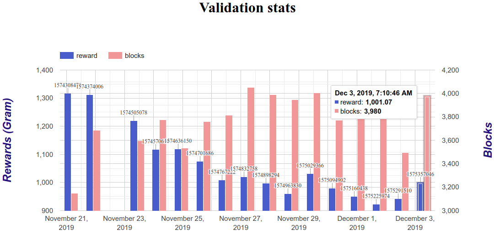

## Usefull commands to make charts and tables from validator-node

> [Please refer to ton-validation](https://github.com/everstake/ton-validation)

##### WARNING! Highly experimental. Use at your own risk!

#### Get rewards in GRAMs using grep and jq
`cat db.json | jq -r '._default' | jq '[.[]]' | grep "reward" |  grep  -v '"reward": -1,' | awk 'BEGIN{FS=":"} {print ($2/1000000000) }'`

#### Convert json to csv using jq

Install jq, copy db.json from the validator-node, and make file **filter.jq** containing:
```
    def tocsv:
      if length == 0 then empty
      else
        (.[0] | keys_unsorted) as $keys
        | (map(keys) | add | unique) as $allkeys
        | ($keys + ($allkeys - $keys)) as $cols
        | ($cols, (.[] as $row | $cols | map($row[.])))
        | @csv
      end ;

    tocsv
```

Then you can convert db.json to csv and import to Libreoffice Calc

`cat db.json  | jq  '._default' | jq '.[]'  | jq -r -s -f filter.jq`

Thanks [SO](https://stackoverflow.com/questions/32960857/how-to-convert-arbitrary-simple-json-to-csv-using-jq/34282594#34282594) for answers!


#### Parse logs from validating node to get your blocks
Let next command run in background with *nohup* or *tmux* to collect logs while your node will validate

`tail -F /TON/dir/with/logs/* | grep --line-buffered "new Block created"  >> blocks.log`

You`ll get these records in blocks.log
```
[ 3][t 4][1573576660.370741129][collator.cpp:3695][!collate(-1,8000000000000000):1195270]	new Block created
[ 3][t 6][1573576663.622580290][collator.cpp:3695][!collate(-1,8000000000000000):1195271]	new Block created
[ 3][t 5][1573576733.900147438][collator.cpp:3695][!collate(-1,8000000000000000):1195292]	new Block created
[ 3][t 3][1573576738.687150002][collator.cpp:3695][!collate(-1,8000000000000000):1195293]	new Block created
[ 3][t 7][1573576741.845279932][collator.cpp:3695][!collate(-1,8000000000000000):1195294]	new Block created
[ 3][t 4][1573576819.818135500][collator.cpp:3695][!collate(-1,8000000000000000):1195317]	new Block created
[ 3][t 6][1573576824.916352749][collator.cpp:3695][!collate(-1,8000000000000000):1195318]	new Block created
[ 3][t 3][1573576894.696839094][collator.cpp:3695][!collate(-1,8000000000000000):1195338]	new Block created
[ 3][t 2][1573576897.733234882][collator.cpp:3695][!collate(-1,8000000000000000):1195339]	new Block created
[ 3][t 1][1573576967.855431080][collator.cpp:3695][!collate(-1,8000000000000000):1195358]	new Block created
[ 3][t 2][1573576970.334105492][collator.cpp:3695][!collate(-1,8000000000000000):1195359]	new Block created
[ 3][t 4][1573576972.634427786][collator.cpp:3695][!collate(-1,8000000000000000):1195360]	new Block created
```

Then you parse them with awk and output to another file, e.g. *blocks_parsed.log*

`cat blocks.log | awk '{print $3}' | awk -F '[' '{print $2}' | awk -F '.' '{print $1}' > blocks_parsed.log`


You`ll get these records 
```
1573636135
1573636146
1573636148
1573636149
1573636163
```


## How to use db.json and blocks_parsed.log to make charts:

#### Installation steps:
```
#set env variable in .bashrc file using export
export BETTER_EXCEPTIONS=1
sudo apt install python3-pip
sudo apt install python3-venv
python3 -m venv env
if you use bash -> source env/bin/activate
#After that your promt will change
pip install -r requirements.txt
#Work with you data
#To exit run
deactivate
```
#### How to run:

***python count_parse.py db.json blocks_parsed.log chart.html***

`Usage: count_parse.py [SWITCHES] db block out_html [validators_elected_for=65536]`

You will get output in console + an html file containing chart with some basic info.




#### Notes

We get a chart showing how many new blocks validator created per validating period + rewards for it.
The tooltip and annotation show election_id in numeric and human-readable datetime format.

Please keep in mind that there may be inconsistent info and error in algorithm!